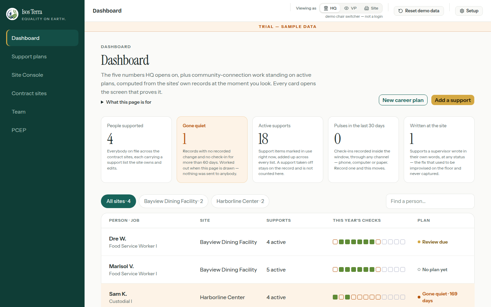
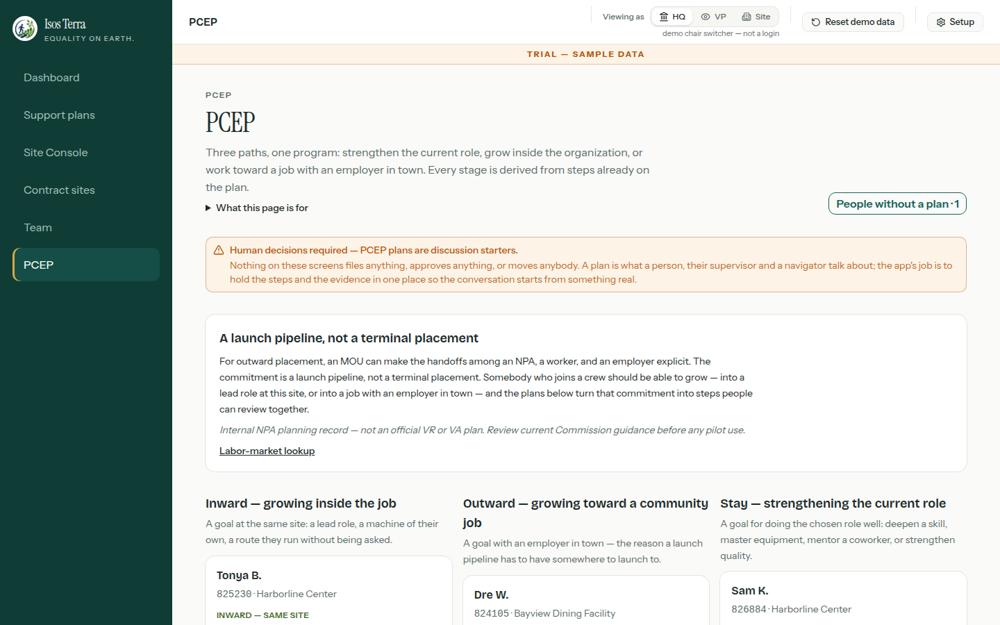
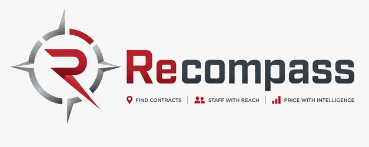

  

  <a href="https://www.linkedin.com/in/cjud/"><b>LinkedIn</b></a> ·
  <a href="https://isosterra.com"><b>Isos Terra</b></a> ·
  <a href="https://capture-plan.vercel.app"><b>Recompass</b></a> ·
  <a href="https://github.com/CJud25/TENS-HQ"><b>TENS HQ</b></a> ·
  <a href="https://www.upwork.com/freelancers/~019c7b0c492bb00fb9"><b>Upwork</b></a> ·
  <a href="mailto:chris@digitaltreehouse.com"><b>chris@digitaltreehouse.com</b></a>

I turn messy operational problems into software that ships and stays shipped. I started in
Compliance, learned to build by automating my own bottlenecks in Power Platform and Python, and now
design and run full products: multi-tenant SaaS, a pricing engine, a mobile game. The common thread
is that every one of them is explicit about what it will not compute, because a number you cannot
defend is worse than no number.

**Now:** Portfolio & Tooling AI Analyst with BRMi, contracted to Navy Federal Credit Union's main
campus. Prior roles and accomplishments are on [LinkedIn](https://www.linkedin.com/in/cjud/).

**Freelance and consulting:** Power Platform and automation work through
[Upwork](https://www.upwork.com/freelancers/~019c7b0c492bb00fb9), and AI-automation consulting through
[DigitalTreehouse](https://digitaltreehouse.com). For either, email
[chris@digitaltreehouse.com](mailto:chris@digitaltreehouse.com).

---

## Building now

Four products, three of them in one arc. TENS HQ (below) finds public contract data. Recompass turns
that into a capture tool for the nonprofits that compete for those contracts. Isos Terra serves the same
nonprofits' workforce plans. The Branch takes the career-decision idea down to the individual. Public
data, then the organization, then the person.

### Isos Terra · [isosterra.com](https://isosterra.com)

A workspace for the accommodation and career plans a nonprofit agency under an AbilityOne-style
contract already keeps: the supports a person uses on the floor, the site's own record of what
changed, the monthly check-in, and the growth plan underneath. Three chairs (HQ, VP, site
supervisor) see the same records at the altitude their job needs, and every number on the
dashboard opens the screen that proves it.

**Status:** deployed with hosted identity (Clerk), Postgres persistence (Prisma on Supabase) and a
proven tenant boundary. Two persistence engines with a parity suite showing they agree. Every record
on it is fictional by design; real personal or health data needs a further governance decision before
it is allowed in. AI is confined to an explicit request for a wording suggestion that a human must
edit and save. No model scores a person, decides eligibility, or changes a plan.

One more screen: the career-plan pipeline, with the human-decisions banner it opens on

<table>
<tr>
<td align="center"></td>
<td>

### Recompass · [capture-plan.vercel.app](https://capture-plan.vercel.app)

Federal contract capture for AbilityOne nonprofit teams as one workflow: **Find → Explore → Price →
Team → Propose**. The engines behind it are the TENS HQ modules, ported into a single multi-tenant
Next.js application with typed contracts between stages.

**Status:** pre-pilot. Find through Team are built and tested (2,300+ tests); Propose is a stub, not a
proposal writer. Subscription billing rails exist in code but no live transaction has occurred. The
data-source gate stays closed until the procurement-list feed is proven, so nothing publishes to
production data yet. Private repository.

</td>
</tr>
<tr>
<td align="center">🌿</td>
<td>

### The Branch

*Don't compare choices. Compare the lives they create.* A career decision platform for young adults
choosing a first serious career and working adults changing one. It projects the whole life a path
creates over five years (earnings, debt, commute, schedule, family load, reversibility) and shows the
exact salary where the ordering flips, with the formula version and every assumption visible. It never
declares a best career or predicts success.

**Status:** in commercial build-out. Identity, participant-owned Postgres with row-level security,
Stripe checkout and fail-closed entitlements are written but unconfigured; there has been no production
release. The public demo routes run entirely on synthetic fixtures. Private repository.

</td>
</tr>
<tr>
<td align="center"></td>
<td>

### Scandalot

*Run for office. Survive the scandals. Claw your way from council to president.* A political satire
roguelite in Flutter for iOS and Android: campaign management, governing choices, debates, donors,
and the scandal that ends careers. Original five-motif score, authored debate trees, save migration
across office terms.

**Status:** release candidate. Store listings and privacy package are drafted and internally
consistent; the remaining gates are Apple infrastructure, device testing and rights evidence, not code.
Not yet submitted.

</td>
</tr>
</table>

### Also in the lab

- **Complement Engine (working name "Tell").** A personality assessment that scores *how* you
  answer, not what you claim. It puts you in
  a situation, reads the tells in your free-text reply (first verb, whether you moved toward a person
  or the facts, hesitation, rewrites), then names the gap between your self-report and your behavior.
  Currently a private working build with a blind two-model report evaluation on real respondents. It
  is not a validated psychometric instrument and is never described as one.

---

## Foundations

**[TENS HQ](https://github.com/CJud25/TENS-HQ)** is where the capture work started: six public
Streamlit applications that hand each other typed JSON rather than one app with six tabs. Find
expiring contracts ([GovCon Recompete Radar](https://govconradar.streamlit.app)), investigate the
incumbent ([ReconRadar](https://reconradar.streamlit.app)), price the work
([FMP Calculator](https://fmp-calculator.streamlit.app)), prove compliance
([CMMC Vault](https://cmmcvault-demo.streamlit.app)), staff it
([ROCC](https://controlcenter.streamlit.app)), and log the pursue/pass call so judgment can be
calibrated later (EDGE, deliberately unbuilt until there is a corpus to calibrate on).

The interesting decisions in that stack were all subtractions. I built a pursuit score and deleted it
because it laundered screened guesses into something that looked retrieved. I never published a recall
figure for the link engine because the miss set is structurally unobservable. The price calculator
refuses to price when an indirect rate is blank, because blank and zero are different things and
treating them the same understated a real buildup by millions. The compliance tool's sample org scores
89 and is still "not conditionally ready," because 88 is necessary, not sufficient.

**Rescue Ops Workbook** is the one other people use every day: a five-module Google Apps Script package
running intake and volunteer coordination on a dog-rescue nonprofit's live workbook. Two bugs surfaced
only after real coordinators used it, a timezone mismatch and a phantom-row append, and no fixture would
have caught either. That gap between defensible and used is the most useful thing in my portfolio to
think about. Not public; it runs on a real organization's data.

**[OpsPilot Command Center](https://github.com/CJud25/OpsCommandCenter)** is one framework that ranks
what to automate, proven across two unrelated operations on a single 0–100 scale.

---

## How I work with AI

I specify, decompose and verify; a model writes most of the line-level code. What is mine is the
specification, the slice boundaries, the gate structure that decides what is allowed to ship, the
adversarial review pass, and the calls about what to refuse to compute or delete. Every project above
carries a dated ledger separating what was executed and measured from what is merely claimed, and
each repo credits the review passes with the finds rather than me.

The same rule applies to AI inside the products. Where a model appears at all it is opt-in,
confined to a suggestion a human edits, and never in the path that scores a person, sets a price,
or confers a status.

---

## Toolkit and credentials

Power Platform (Automate, Apps, BI) · Python · TypeScript / Next.js · Streamlit · Flutter · Postgres
(Prisma, Supabase, RLS) · Clerk · Stripe · Google Apps Script · Playwright / Vitest

Microsoft Certified Azure AI Engineer Associate, plus additional Microsoft and Anthropic credentials.
Full list on [LinkedIn](https://www.linkedin.com/in/cjud/).

<!-- TODO(Chris): list the specific certs here if you want them visible without a click. -->
